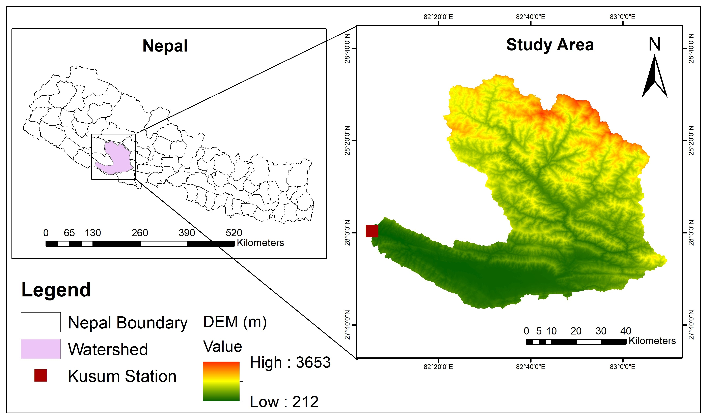
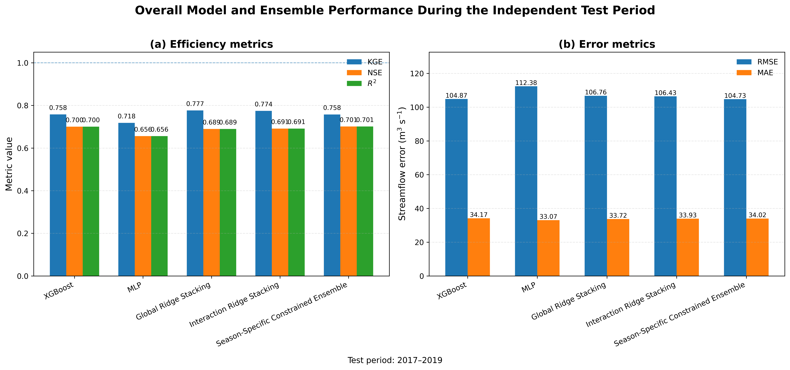

# Improving Streamflow Prediction in a Monsoon Dominated Basin Using Satellite Precipitation and Season Specific Machine Learning Ensembles
## A Case Study of the West Rapti River Basin, Nepal

### Project Overview

Accurate streamflow prediction is important for flood management, water
resources planning, and hydrological forecasting. However, streamflow
prediction can be challenging in data scarce regions such as Nepal, where conventional
ground based observations are limited.

This study explores the use of satellite based precipitation and
meteorological information, and evaluates
both individual machine learning models and ensemble learning approaches to predict daily
streamflow.

### Study Area

The West Rapti River Basin is located in the mid-western region of Nepal
and covers approximately 5,200 km². The basin is predominantly
influenced by the summer monsoon, with 80% rainfall concentrated between
June and September.
Daily observed streamflow at the Kusum hydrological station was used
as the prediction target, with satellite precipitation and meteorological
datasets used as input variables.

### Data

The modelling framework uses:
| Variable | Data Product | Temporal Resolution | Spatial Resolution |
|---|---|---|---|
| Precipitation | GPM IMERG | Daily | 0.1° |
| Temperature | MSWX | Daily | 0.1° |
| Potential Evapotranspiration | GLEAM 3.8a | Daily | 0.25° |
| Streamflow | Kusum Station | Daily | Station-based |

**Study period:** 2003–2019

The raw input dataset is not included in this repository. 

### Feature Engineering

The modelling framework incorporates hydrologically relevant temporal and
seasonal features, including:

- Daily precipitation
- Temperature
- Potential evapotranspiration
- 3-day precipitation accumulation
- 7-day precipitation accumulation
- 14-day precipitation accumulation
- Rolling temperature statistics
- Rolling PET statistics
- Precipitation gradient
- Seasonal/cyclic variables
- Monsoon indicator

These features were applied to represent short-term precipitation forcing,
antecedent hydrometeorological conditions, and seasonal variability in
streamflow generation.

### Machine Learning Models

The following machine learning approaches were evaluated:

- Linear Regression
- Ridge Regression
- Lasso
- Elastic Net
- Decision Tree
- Random Forest
- Extra Trees
- Gradient Boosting
- Bagging
- XGBoost
- LightGBM
- Multilayer Perceptron (MLP)
- Long Short-Term Memory (LSTM)

### Temporal Validation Strategy

A chronological expanding-window validation framework was used to reduce the risk of temporal data leakage.

### Model Development: 2003–2016

The 2003–2016 period was used for:
- Expanding-window out-of-fold validation
- Model comparison
- Model selection
- Ensemble development

### Independent Test dataset: 2017–2019

The 2017–2019 period was retained as an independent test period and was not
used during model selection to prevent data leakage.

### Ensemble Learning

After two best performing and least correlated model selection, three ensemble approaches were evaluated:

### 1. Global Ridge Stacking

Predictions from the selected base models were combined using a Ridge
regression meta model. A single set of coefficients was learned across the
entire model development period, providing globally constant contributions
from each base model.

### 2. Interaction Ridge Stacking

An interaction between base model predictions and the monsoon indicator was
introduced into the Ridge meta model. This allows the contribution of the
base models to vary between monsoon and non-monsoon conditions.

### 3. Season-Specific Constrained Ensemble

Separate ensemble weights were optimized for monsoon and dry-season
conditions. The weights were constrained to be non-negative and sum to one,
allowing the contribution of each base model to vary according to the
hydrological regime.

### Evaluation Metrics

Model performance was evaluated using:

- R² :- coefficient of determination
- NSE :- Nash–Sutcliffe Efficiency
- KGE :- Kling–Gupta Efficiency
- RMSE :- Root Mean Square Error
- MAE :- Mean Absolute Error

### Results

### Independent Test Period: 2017–2019

| Model | R² | NSE | KGE | RMSE (m³ s⁻¹) | MAE (m³ s⁻¹) |
|---|---:|---:|---:|---:|---:|
| XGBoost | 0.700 | 0.700 | 0.758 | 104.87 | 34.17 |
| MLP | 0.656 | 0.656 | 0.718 | 112.38 | 33.07 |
| Global Ridge Stacking | 0.692 | 0.689 | 0.777 | 106.76 | 33.72 |
| Interaction Ridge Stacking | 0.693 | 0.691 | 0.774 | 106.43 | 33.93 |
| Season-Specific Constrained Ensemble | 0.706 | 0.701 | 0.758 | 104.73 | 34.02 |

### Key Findings

- XGBoost provided strong standalone streamflow prediction, achieving a KGE
  of 0.758.
- Global Ridge Stacking achieved the highest KGE (0.777).
- The Season-Specific Constrained Ensemble achieved the highest R² (0.706)
  and lowest RMSE (104.73 m³ s⁻¹).
- MLP produced the lowest MAE (33.07 m³ s⁻¹).
- No single model consistently outperformed all alternatives across every
  evaluation metric.
- Ensemble approaches produced competitive performance with the strongest
  individual models.

### Model Performance

### Observed vs. Predicted Streamflow

The scatter plots during the 2017–2019 test period shows a strong agreement between observed and predicted streamflow for low to moderate flow conditions. However, the models generally underestimate the largest observed streamflow values, indicating limited ability to reproduce extreme flood peaks during the test period.

### Hydrograph Comparison

The hydrograph comparison illustrates the ability of the models to reproduce the overall temporal dynamics of streamflow, including low flow conditions, rising limbs, and recession periods. However, the models generally underestimate the magnitude of the most extreme high flow events, particularly the largest observed peaks during the monsoon period.

### Repository Structure

west-rapti-streamflow-ml/
├── README.md
├── requirements.txt
├── .gitignore
├── streamflow_prediction.py
└── figures/
    ├── Study_Area.jpg
    ├── model_performance.png
    ├── observed_vs_predicted.png
    └── hydrograph.png
